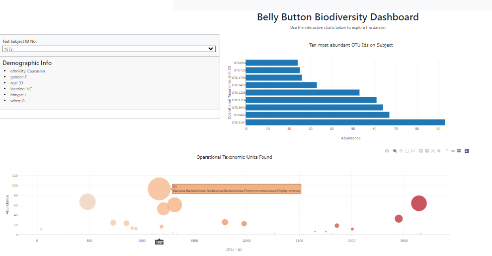

# belly-button-challenge
This challenge involved producing interactive visualizations to display information from the Belly Button Biodiversity Dataset. https://robdunnlab.com/projects/belly-button-biodiversity/

The D3 javascript library was used to read in the json file for analysis.  Several charts were created along with a panel showing demographic information about the owner of the belly button chosen.  Hovering over a bar or a bubble provides additional information about the operational taxonomic unit.  The demographic panel is interactive in that it can be used to select one of the dozens of belly buttons from this particular dataset.

The bar chart shows the 10 most abundant bacteria for the belly button and the bubble chart shows bubbles with size corresponding to the abundance of the bacteria in the sample.

The app is deployed to GitHub Pages at  https://bluffermk.github.io/belly-button-challenge/